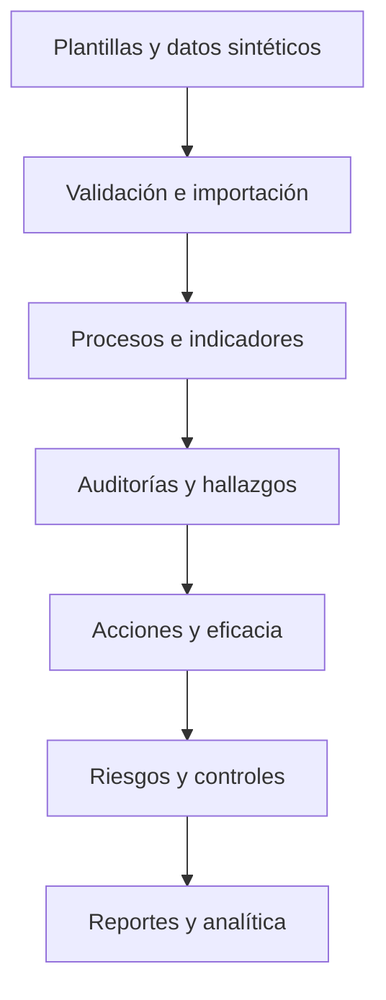
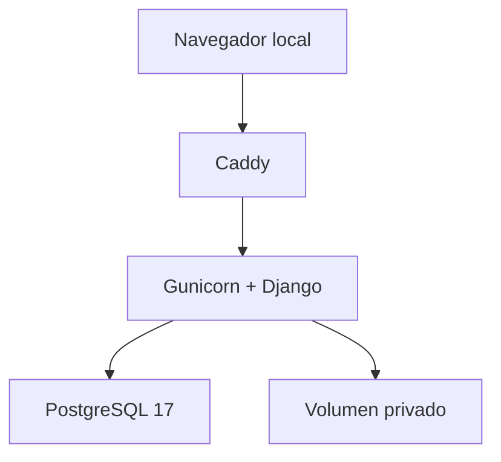

# Trazamétrica Salud Perú

[](https://github.com/G3RARD0-TICONA/trazametrica-salud-peru/actions/workflows/ci.yml)


**Sistema demostrativo para gestionar procesos, calidad, indicadores, riesgos y mejora administrativa en clínicas privadas del Perú.**

Trazamétrica Salud Perú conecta fuentes de datos, procesos, KPI, auditorías, hallazgos, acciones correctivas, riesgos y reportes en una cadena verificable. El proyecto está construido como portafolio técnico reproducible con datos exclusivamente sintéticos.

> [!IMPORTANT]
> P00–P18 están aprobadas internamente y sus puertas de calidad se encuentran cerradas. Esta aprobación pertenece al gobierno del proyecto: no constituye certificación, acreditación, autorización sanitaria ni validación de una clínica.

> [!WARNING]
> La aplicación es una demostración administrativa y **no clínica**. No debe recibir datos personales o de salud reales ni utilizarse para atención, diagnóstico, tratamiento o decisiones sobre pacientes.

## Qué demuestra

- gobierno y trazabilidad de requisitos desde el diseño hasta la evidencia de prueba;
- catálogos organizacionales, documentos y fichas de procesos versionadas;
- importación Excel controlada y cálculo reproducible de indicadores;
- auditorías, hallazgos, no conformidades y acciones correctivas segregadas;
- riesgos inherentes y residuales, controles versionados y alertas;
- exportaciones CSV, Excel y PDF, además de conjuntos para Power BI Desktop;
- estadística descriptiva y modelos administrativos reproducibles;
- seguridad, rendimiento, accesibilidad, recuperación y despliegue local validados en CI.

## Trazabilidad principal



Cada resultado conserva su fuente, versión, actor, estado y evidencia. Las aprobaciones sensibles exigen segregación de funciones y los registros publicados no se sobrescriben.

## Capacidades

| Área | Capacidades implementadas |
|---|---|
| Gobierno y acceso | requisitos trazables, roles, capacidades, vigencias, mínimo privilegio y segregación |
| Organización y procesos | sedes, servicios, áreas, responsables, documentos, SIPOC y fichas versionadas |
| Datos e indicadores | plantillas XLSX seguras, cargas auditables, fórmulas declarativas y KPI reproducibles |
| Calidad y mejora | planes de auditoría, hallazgos, causa raíz, acciones, evidencias y revisión de eficacia |
| Riesgos y controles | matriz 5×5, riesgo inherente/residual, controles versionados, revisiones y alertas |
| Reportes y analítica | tablero filtrable, CSV/XLSX/PDF, Power BI Desktop, estadística y regresiones demostrativas |

El detalle funcional y las decisiones de cada incremento se encuentran en el [índice de documentación](docs/README.md) y el [roadmap P00–P18](docs/ROADMAP.md).

## Arquitectura de la demostración



- **Aplicación:** Python 3.13, Django 5.2 LTS y Gunicorn.
- **Persistencia:** PostgreSQL 17 en desarrollo, pruebas y demostración.
- **Intercambio:** plantillas XLSX, exportaciones CSV/XLSX/PDF y contrato para Power BI Desktop.
- **Ejecución:** Docker Compose con Caddy como proxy local y contenedor web no privilegiado.
- **Calidad:** GitHub Actions, Ruff, mypy, pytest, coverage, Bandit y `pip-audit`.

GitHub publica el código y la documentación; no aloja la aplicación. La demo se ejecuta únicamente en el equipo local mediante Docker y no debe exponerse con túneles, reenvío de puertos ni una IP pública.

## Evidencia de calidad

| Control | Evidencia de `v0.1.1` |
|---|---|
| Pruebas | 174 pruebas aprobadas sobre PostgreSQL 17 |
| Cobertura | 82 %, con puerta mínima de 80 % |
| Calidad de código | documentación, Ruff, mypy, migraciones y comprobaciones Django conformes |
| Seguridad | puerta contra secretos/datos reales, Bandit y auditoría de dependencias conformes |
| Rendimiento | flujos primarios, presupuestos SQL, 100 000 observaciones y XLSX de 10 000 filas validados |
| Accesibilidad | estructura automatizada y checklist manual WCAG 2.2 AA del alcance demostrativo |
| Despliegue | build, arranque, sondas y detención del stack Docker verificados en CI |

Estos resultados son evidencia interna reproducible del prototipo; no equivalen a pentest, certificación WCAG/OWASP, garantía productiva ni validación externa.

## Demostración local con Docker

### Requisitos

- Docker Engine o Docker Desktop con Docker Compose;
- puertos locales `8080` y `8443` disponibles;
- al menos 2 GB de memoria disponible recomendada para el stack.

### Inicio rápido

```bash
cp .env.demo.example .env.demo
# Reemplace en .env.demo los tres valores marcados como replace-with-...
docker compose --env-file .env.demo -f compose.demo.yaml up --build -d
docker compose --env-file .env.demo -f compose.demo.yaml exec web \
  python src/manage.py bootstrap_access
```

Después cargue la semilla sintética siguiendo el [manual de operación](docs/18-despliegue-publicacion/MANUAL_OPERACION.md) y abra `http://localhost:8080`.

Compruebe el entorno:

```bash
curl --fail http://localhost:8080/health/live/
curl --fail http://localhost:8080/health/ready/
docker compose --env-file .env.demo -f compose.demo.yaml ps
```

Detenga la demostración sin eliminar sus volúmenes:

```bash
docker compose --env-file .env.demo -f compose.demo.yaml down
```

## Recorrido recomendado

1. Revise la organización, sedes, servicios y responsables sintéticos.
2. Explore documentos, procesos y fichas SIPOC versionadas.
3. Consulte cargas Excel, indicadores y resultados publicados.
4. Siga un hallazgo hasta su causa, acción, evidencia y revisión de eficacia.
5. Revise riesgos, controles, alertas, reportes y analítica.

## Documentación esencial

| Documento | Contenido |
|---|---|
| [Arquitectura](docs/04-arquitectura-entornos/ARQUITECTURA.md) | componentes, límites y decisiones técnicas |
| [Modelo de datos](docs/05-modelo-datos/README.md) | entidades, integridad, índices y migraciones |
| [Matriz de permisos](docs/06-identidad-acceso/MATRIZ_PERMISOS.md) | roles, capacidades y segregación |
| [Plan integral de pruebas](docs/17-validacion-integral/PLAN_PRUEBAS.md) | estrategia, regresión y criterios de aceptación |
| [Seguridad técnica](docs/17-validacion-integral/SEGURIDAD.md) | controles verificados y riesgo residual |
| [Operación de la demo](docs/18-despliegue-publicacion/MANUAL_OPERACION.md) | preparación, semillas, arranque y detención |
| [Recuperación](docs/18-despliegue-publicacion/RECUPERACION_OPERATIVA.md) | respaldo y restauración aislada |
| [Política de seguridad](SECURITY.md) | reporte privado, datos prohibidos y respuesta |

## Datos, límites y no afiliación

Todos los ejemplos, usuarios, organizaciones, archivos y resultados son ficticios. Están prohibidos los DNI, historias clínicas, diagnósticos, recetas, datos de contacto reales, credenciales y documentos de organizaciones reales.

Trazamétrica Salud Perú es un proyecto independiente. No está afiliado, certificado ni aprobado por MINSA, SUSALUD, ISO, JCI, SANNA, AUNA, Grupo San Pablo u otra entidad o clínica. Las referencias normativas y organizacionales tienen fines de investigación y demostración.

Consulte [SECURITY.md](SECURITY.md) antes de reportar una vulnerabilidad y [NOTICE.md](NOTICE.md) antes de reutilizar cualquier contenido.

## Autoría y derechos

**Gerardo Rodney Ticona Moscoso** — 2026.

Este repositorio es público para revisión y portafolio profesional, pero no concede una licencia general de uso, copia, modificación, distribución o comercialización. Todos los derechos están reservados; los términos completos se encuentran en [NOTICE.md](NOTICE.md).
