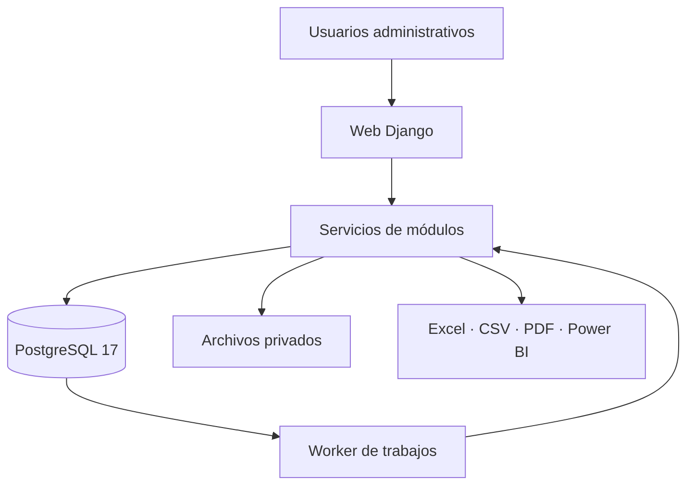
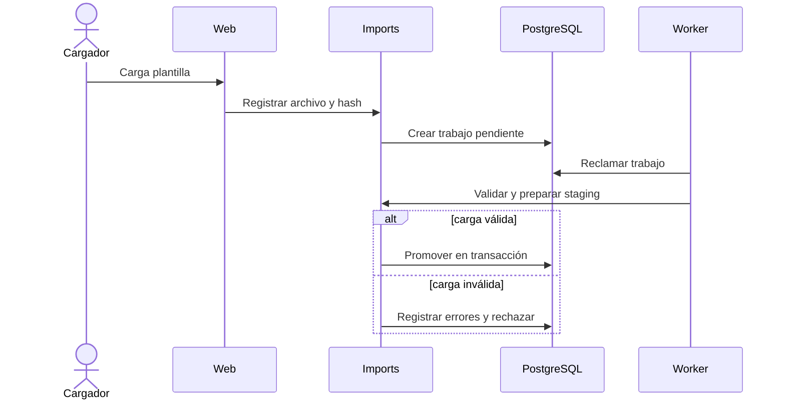

# Arquitectura y módulos

## 1. Estilo arquitectónico

El MVP será un **monolito modular**: una aplicación desplegable, una base PostgreSQL y módulos internos con responsabilidades y dependencias controladas. Esta decisión preserva transacciones para cargas, aprobaciones y bitácora; simplifica la ejecución local; y evita la complejidad de redes, consistencia distribuida y observabilidad de microservicios.

La modularidad se comprobará mediante reglas de importación y pruebas. Un único despliegue no autoriza acoplamiento libre.



## 2. Capas por módulo

| Capa | Responsabilidad | Prohibición |
|---|---|---|
| Presentación | URLs, vistas, formularios, plantillas y respuestas | No contiene reglas de negocio ni SQL directo |
| Aplicación | Casos de uso, autorización contextual y transacciones | No renderiza HTML |
| Dominio | Estados, políticas, cálculos y validaciones puras | No depende de HTTP, archivos o tareas |
| Persistencia | Modelos ORM, repositorios y consultas optimizadas | No decide permisos ni transiciones |
| Infraestructura | Excel, almacenamiento, PDF, logging y adaptadores | No se invoca directamente desde plantillas |

Las consultas de lectura complejas usarán `selectors`; las operaciones usarán `services`. Toda mutación crítica comienza en un servicio de aplicación con transacción explícita.

## 3. Módulos

| ID | Aplicación Django | Responsabilidad | Dependencias permitidas |
|---|---|---|---|
| MOD-01 | `core` | Tipos comunes, tiempo, identificadores y utilidades sin negocio | Ninguna aplicación funcional |
| MOD-02 | `accounts` | Usuario personalizado, roles, sesiones y permisos | `core` |
| MOD-03 | `organizations` | Organización, sedes, servicios, áreas y responsables | `core`, `accounts` |
| MOD-04 | `processes` | Procesos, versiones, SIPOC y estados | `core`, `organizations` |
| MOD-05 | `documents` | Documentos administrativos, versiones y vigencias | `core`, `organizations`, `processes` |
| MOD-06 | `imports` | Plantillas, archivos, staging, errores y promoción | `core`, `organizations`, adaptadores |
| MOD-07 | `indicators` | Fichas, fórmulas seguras, resultados y metas | `core`, `organizations`, `processes`, `imports` |
| MOD-08 | `audits` | Planes, listas, ejecución, hallazgos y no conformidades | `core`, `organizations`, `processes`, `documents` |
| MOD-09 | `improvements` | Causa, acciones, evidencia, eficacia y cierre | `core`, `accounts`, `audits` |
| MOD-10 | `risks` | Riesgos, controles, evaluaciones y revisiones | `core`, `organizations`, `processes`, `improvements` |
| MOD-11 | `reports` | Consultas, tableros y contratos de exportación | Lectura controlada de módulos funcionales |
| MOD-12 | `auditlog` | Eventos append-only, correlación y consulta | `core`, referencias desacopladas |

`auditlog` recibirá eventos desde servicios de aplicación y no mediante señales genéricas para operaciones críticas. Las señales podrán complementar tareas no críticas, pero no sustituirán una transacción trazable.

## 4. Dependencias y límites

- Ningún módulo funcional importa vistas, formularios o plantillas de otro módulo.
- `reports` no modifica datos funcionales.
- `imports` no conoce fórmulas KPI; publica conjuntos aceptados que `indicators` consume.
- `accounts` no depende de módulos de negocio.
- Los enlaces entre auditoría, mejora y riesgo usan servicios públicos, no acceso a tablas internas.
- Los ciclos de importación entre aplicaciones se consideran falla de arquitectura.

## 5. Flujo de importación



El worker será único en el MVP. Reclamará trabajos con bloqueo de fila, registrará intentos y no procesará dos veces el mismo trabajo. P17 deberá probar recuperación tras interrupción.

## 6. Presentación e integración

- Django Templates y formularios del servidor constituyen la interfaz principal.
- JavaScript se limita a mejora progresiva; los flujos críticos funcionarán con envío HTTP tradicional.
- No habrá API pública en el MVP. Endpoints JSON internos requerirán sesión y la misma autorización.
- Power BI Desktop recibirá archivos o vistas exportadas con contrato versionado; no accederá directamente a tablas operativas.
- PDF y Excel se implementarán mediante adaptadores sustituibles definidos en P15.

## 7. Estructura prevista

```text
src/
  manage.py
  config/
    settings/{base,local,test,demo}.py
  apps/
    core/ accounts/ organizations/ processes/ documents/
    imports/ indicators/ audits/ improvements/ risks/
    reports/ auditlog/
tests/
  unit/ integration/ acceptance/
data/synthetic/
docs/
```

P05 podrá ajustar nombres físicos, pero no eliminar límites sin una decisión arquitectónica registrada.

## 8. Registro de decisiones arquitectónicas

Las siguientes decisiones fueron aceptadas al cerrar G04 el 20 de agosto de 2026. Su aceptación autoriza utilizarlas como línea base técnica del proyecto; no autoriza todavía una implementación productiva.

| ADR | Decisión | Motivo | Consecuencia | Estado |
|---|---|---|---|---|
| ADR-001 | Monolito modular | Transacciones, simplicidad y equipo pequeño | Límites internos deben probarse | Aceptada |
| ADR-002 | Python 3.13 + Django 5.2 LTS | Compatibilidad, soporte y estabilidad | Actualizar parches y revisar fin de soporte | Aceptada |
| ADR-003 | PostgreSQL 17 en todos los entornos | Evitar divergencia con SQLite | Requiere servicio DB local/CI | Aceptada |
| ADR-004 | HTML de servidor, sin SPA | Menor complejidad y accesibilidad progresiva | Interactividad avanzada será selectiva | Aceptada |
| ADR-005 | Una organización por instalación | Suficiente para demo y menor riesgo | Multitenencia exige rediseño futuro | Aceptada |
| ADR-006 | Worker único sobre trabajos PostgreSQL | Evitar broker adicional en MVP | Escala limitada y recuperación obligatoria | Aceptada |
| ADR-007 | Archivos privados mediante adaptador | Autorización y portabilidad | Requiere volumen y manifiesto coherentes | Aceptada |
| ADR-008 | Usuario personalizado desde el inicio | Evitar migración riesgosa posterior | P05/P06 deben fijar campos y permisos | Aceptada |
| ADR-009 | Fórmulas declarativas; prohibido `eval` | Seguridad y reproducibilidad | Operadores disponibles serán limitados | Aceptada |
| ADR-010 | Power BI mediante exportación versionada | Gratuito y desacoplado | Sin actualización automática en servicio | Aceptada |
| ADR-011 | Configuración por entorno y secretos externos | Reproducibilidad sin exposición | Requiere validación al inicio | Aceptada |
| ADR-012 | PostgreSQL conserva UTC; interfaz Lima | Instantes inequívocos y uso local | Conversión obligatoria en presentación | Aceptada |
| ADR-013 | PR y CI como puerta de integración | Evidencia y control de cambios | Requiere checks mantenidos | Aceptada |
| ADR-014 | Sin API pública en MVP | No existe consumidor aprobado | Una API futura requerirá contrato y ADR | Aceptada |

### Regla de cambio

Una decisión aceptada no se edita para ocultar su historia. Se crea una ADR que la sustituya e identifique contexto, alternativas, impacto en requisitos, migración, pruebas y reversión.

### Decisiones diferidas

- P05: claves, relaciones, historización, precisión decimal e índices.
- P06: modelo granular de permisos y cuentas de demostración.
- P10: formato definitivo de plantillas y staging.
- P15: bibliotecas concretas de Excel/PDF y contratos Power BI.
- P18: servidor WSGI, proxy, proveedor y dominio de demo.
