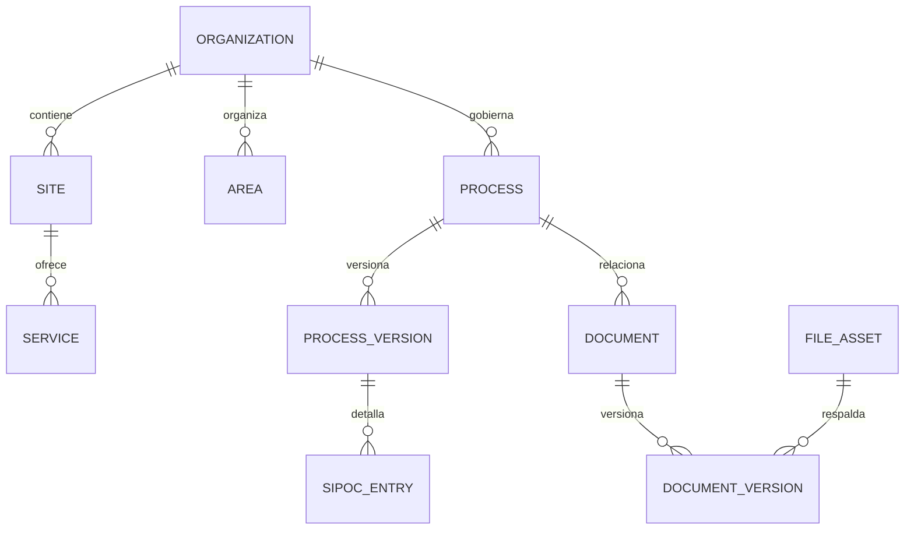
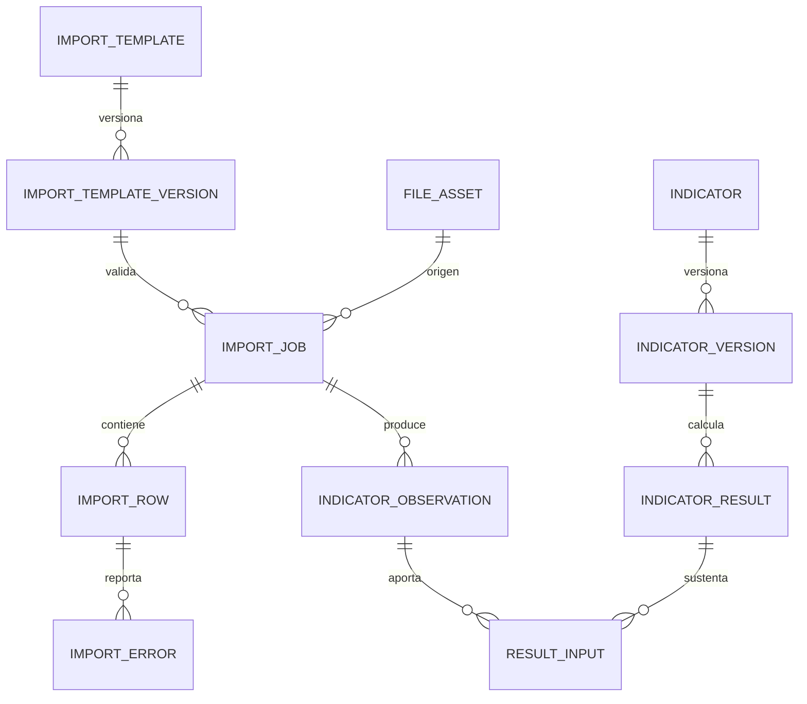
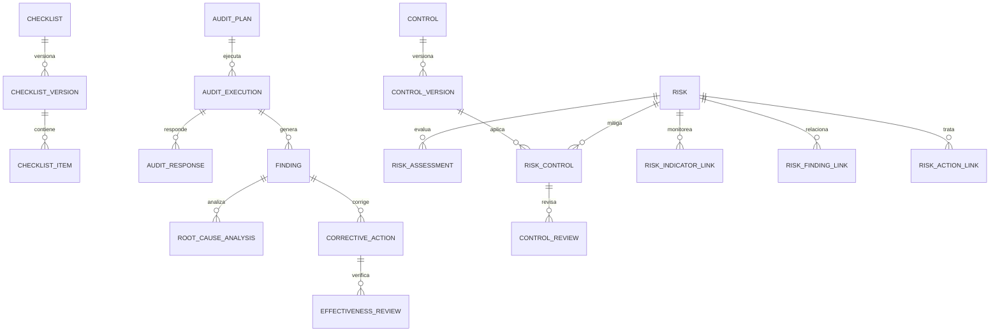

# Modelo de dominio y relaciones

## 1. Principios

1. Cada tabla pertenece a un módulo de P04 y tiene una responsabilidad única.
2. Las relaciones críticas usan claves foráneas reales; no se usarán identificadores genéricos para simular integridad.
3. Una entidad versionable conserva una raíz estable y versiones numeradas separadas.
4. Un registro aprobado o publicado no se sobrescribe; una corrección crea una nueva versión o resultado.
5. La bitácora registra eventos, pero no sustituye el estado funcional ni las tablas de versiones.
6. Ninguna entidad representa pacientes, historias clínicas, diagnósticos, recetas o resultados asistenciales.

## 2. Organización, procesos y documentos

La organización, sede, servicio y área son maestros desactivables. `Process` y `Document` conservan el código estable; sus tablas de versión guardan contenido, vigencia, autoría y aprobación.

## 3. Importaciones e indicadores

`ImportRow.raw_data` mantiene temporalmente datos sintéticos normalizados. Solo un trabajo aceptado y promovido puede originar observaciones. El resultado KPI conserva la versión exacta de fórmula y las observaciones utilizadas.

## 4. Auditoría, mejora y riesgos

Las relaciones muchos-a-muchos se materializan mediante tablas explícitas cuando contienen contexto. `risk_control` conserva la versión aprobada del control aplicada al riesgo; `risk_indicator_link`, `risk_finding_link` y `risk_action_link` preservan vínculos verificables sin claves polimórficas. Las evidencias se enlazan con tablas específicas `finding_evidence` y `action_evidence`.

## 5. Trazabilidad y reportes

- `AuditEvent` conserva actor, instante, objeto, acción, resultado, correlación y contexto técnico mínimo. Es append-only desde la aplicación.
- `ExportContract` versiona columnas, tipos y orden de un conjunto para Excel, CSV o Power BI Desktop.
- `ExportRun` guarda contrato, filtros, archivo resultante, hash, actor y fecha.
- `FileAsset` solo contiene metadatos; la ruta física es opaca y el acceso siempre pasa por autorización.
- Los reportes leen tablas funcionales mediante consultas controladas; no mantienen copias editables del negocio.
- `AnalysisDefinition` versiona algoritmo, indicador y parámetros; `AnalysisRun` conserva entradas, métricas, supuestos, resultados y hashes.

## 6. Límites de módulos

| Módulo | Tablas | Puede referenciar |
|---|---:|---|
| `accounts` | 3 | `core` |
| `organizations` | 5 | `accounts` |
| `processes` | 3 | `organizations`, `accounts` |
| `documents` | 5 | `organizations`, `processes`, `accounts` |
| `imports` | 5 | `documents`, `organizations`, `accounts` |
| `indicators` | 5 | `imports`, `processes`, `organizations`, `accounts` |
| `audits` | 8 | `processes`, `documents`, `organizations`, `accounts` |
| `improvements` | 4 | `audits`, `documents`, `accounts` |
| `risks` | 9 | `processes`, `indicators`, `audits`, `improvements`, `organizations`, `accounts` |
| `reports` | 2 | Lectura de módulos funcionales y `documents` |
| `analytics` | 2 | `indicators`, `accounts`, `auditlog` |
| `auditlog` | 1 | Referencias desacopladas por identificador y etiqueta |
| **Total** | **52** | |

`core` define tipos, bases abstractas y utilidades, pero no tendrá una tabla funcional propia en P05.
