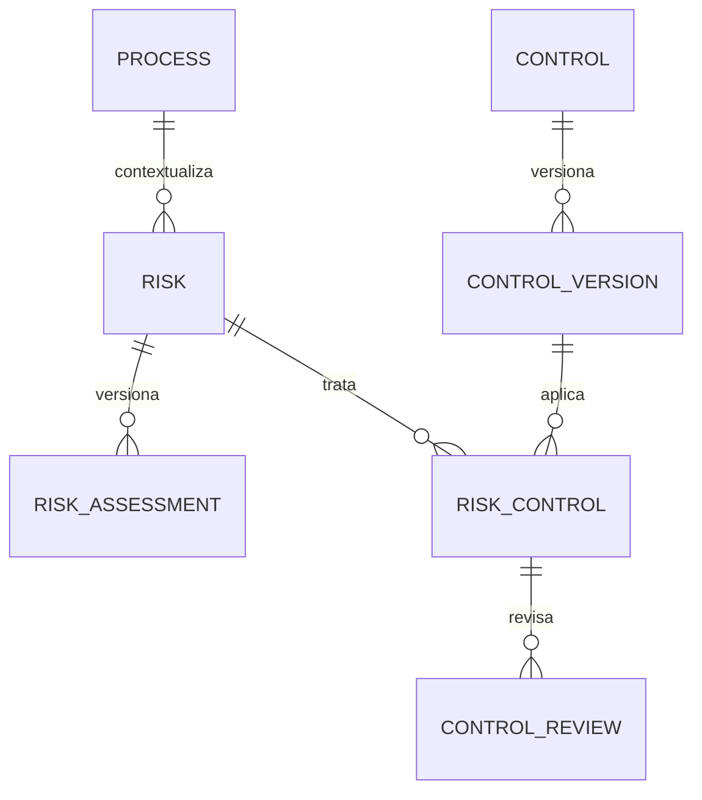

# Modelo de riesgos y controles

## 1. Entidades

| Entidad | Responsabilidad |
|---|---|
| `Risk` | Identidad estable, contexto del proceso, causa, evento, consecuencia, responsable y estado |
| `RiskAssessment` | Versión de probabilidad, impacto, nivel inherente, nivel residual y próxima revisión |
| `Control` | Identidad estable, código, nombre, organización y responsable |
| `ControlVersion` | Descripción, tipo, frecuencia, vigencia y aprobación inmutable del control |
| `RiskControl` | Aplicación de una versión de control a un riesgo y eficacia esperada |
| `ControlReview` | Revisión independiente, resultado, notas y siguiente revisión |
| `RiskIndicatorLink` | Vínculo explícito entre riesgo e indicador |
| `RiskFindingLink` | Vínculo explícito entre riesgo y hallazgo |
| `RiskActionLink` | Vínculo explícito entre riesgo y acción correctiva |

## 2. Relaciones

Los vínculos con indicadores, hallazgos y acciones usan claves foráneas reales y tablas separadas. No se usan tipos de contenido, identificadores genéricos ni JSON para simular integridad.

## 3. Versionado

Una evaluación aprobada se sustituye al aprobar la versión siguiente. La versión anterior conserva valores, autor, envío, aprobador, decisión y fechas; ninguna aprobación se sobrescribe.

El control mantiene código y responsable en su raíz. La descripción operativa, el tipo, la frecuencia y la vigencia pertenecen a `ControlVersion`, de forma que un cambio crea otra versión en lugar de alterar la aprobada.

## 4. Dependencias

El módulo `risks` depende de cuentas, organizaciones, procesos, indicadores, auditorías y mejora. Estas dependencias se limitan a modelos públicos y servicios; no importa vistas ni plantillas de otros módulos.
