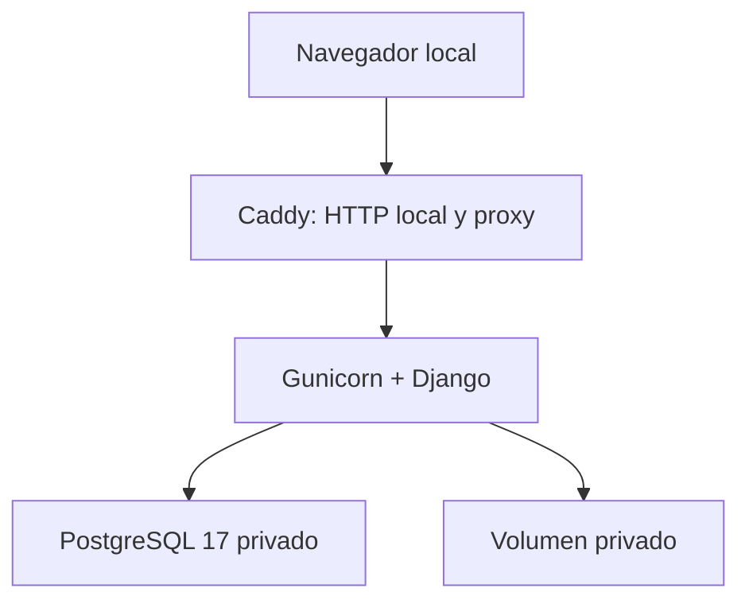

# Arquitectura de demostración

## Topología

Solo Caddy expone el puerto local `8080`. PostgreSQL, el volumen privado y las claves no se publican. El contenedor web no se ejecuta como `root`; arranca con `check --deploy`, migraciones y `collectstatic` antes de atender tráfico.

## Publicación gratuita

La modalidad aprobada no contrata servidor ni dominio. GitHub publica el código, los manuales, el historial y la release; no aloja la aplicación Django. La aplicación se ejecuta en el equipo del demostrador con Docker y se abre en `http://localhost:8080`.

El HTTP local no debe exponerse mediante reenvío de puertos, túneles ni una IP pública. Si en el futuro se decide publicar en Internet, debe abrirse una nueva evaluación de hosting, TLS, dominio, secretos, respaldo y endurecimiento; esa ampliación queda fuera de P18.

## Datos y archivos

La demo utiliza únicamente semillas sintéticas. El volumen `private_demo_data` no es servido por Caddy; solo existe para artefactos futuros del proceso web. No se cargan ni se conservan documentos reales. Todo archivo que se agregue posteriormente debe superar la validación, la confirmación sintética y el análisis antimalware aprobado antes de estar disponible.

## Observabilidad mínima

- `/health/live/`: proceso web disponible.
- `/health/ready/`: proceso web y PostgreSQL disponibles.
- `X-Correlation-ID`: correlación sin cuerpo, query string ni credenciales.
- logs del contenedor: nivel operativo; no se registran contraseñas ni datos de formularios.

Las sondas no sustituyen monitorización 24/7, SLA, pentest ni soporte productivo.
