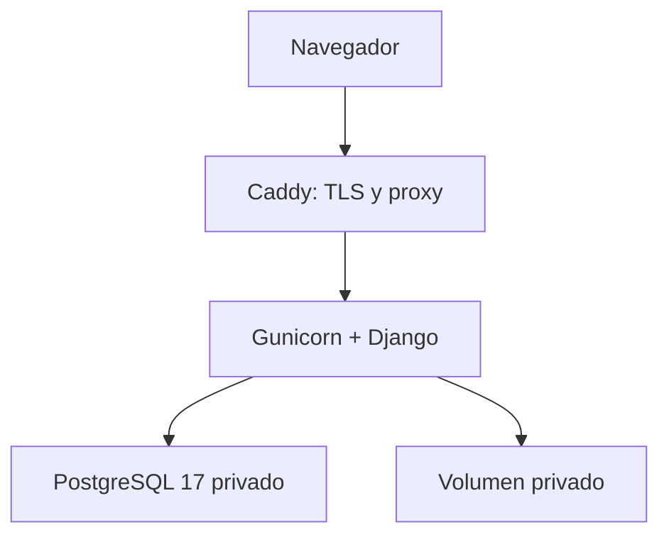

# Arquitectura de demostración

## Topología

Solo Caddy expone puertos. PostgreSQL, el volumen privado y las claves quedan fuera de Internet. El contenedor web no se ejecuta como `root`; arranca con `check --deploy`, migraciones y `collectstatic` antes de atender tráfico.

## TLS y dominio

`DEMO_CADDY_ADDRESS` recibe el FQDN que pertenece al titular, por ejemplo `demo.tu-dominio.pe`. Caddy obtiene y renueva TLS automáticamente cuando el DNS A/AAAA ya apunta al servidor y los puertos 80/443 están abiertos. Para el simulacro local se utiliza `:80`, que no representa una publicación HTTPS.

No se fija un proveedor comercial ni un costo en el repositorio: precios, créditos y políticas cambian, y la cuenta debe permanecer bajo control del titular. La publicación requiere como mínimo una instancia con Docker, DNS propio, 2 GB de memoria recomendados, almacenamiento persistente y respaldo verificable.

## Datos y archivos

La demo utiliza únicamente semillas sintéticas. El volumen `private_demo_data` no es servido por Caddy; solo existe para artefactos futuros del proceso web. No se cargan ni se conservan documentos reales. Todo archivo que se agregue posteriormente debe superar la validación, la confirmación sintética y el análisis antimalware aprobado antes de estar disponible.

## Observabilidad mínima

- `/health/live/`: proceso web disponible.
- `/health/ready/`: proceso web y PostgreSQL disponibles.
- `X-Correlation-ID`: correlación sin cuerpo, query string ni credenciales.
- logs del contenedor: nivel operativo; no se registran contraseñas ni datos de formularios.

Las sondas no sustituyen monitorización 24/7, SLA, pentest ni soporte productivo.
